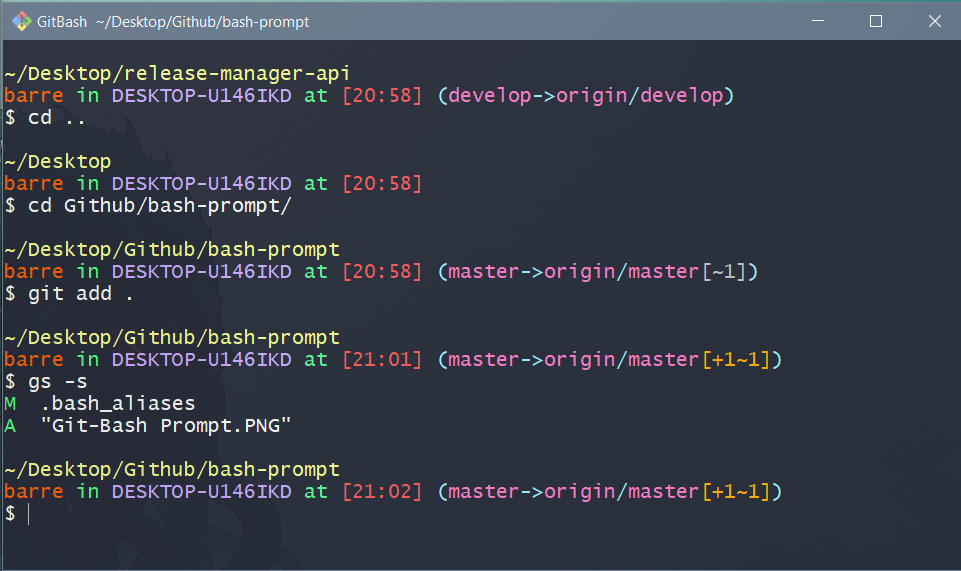

# Bash-Prompt
An informative, clean, and simple alternative to the traditional Git-Bash for Windows prompt.

## Installation
Copy the contents of `bash.bashrc` and `~.bash_aliases` (create if not yet existing) to your `/Program Files/Git/etc/bash.bashrc` and `~/.bashrc` files. The prompt looks the best in "dracula" theme, set by "Terminal Title Bar" >> "Options" >> "Theme." Change the terminal transparency to Low/Medium for optimum aesthetic.

## Aliases

Bash-Prompt offers simple, easy-to-remember aliases for:
1. Git
2. Git Flow
3. Virtual Environments
4. Miscellaneous (general convenience)

Confused? Run `gitaliases`, `venvaliases`, `convenience`, or `symbols` to display more information about the aliases and prompt structure. Change the alias names and corresponding commands to your preference.

For example, running `symbols` on an active Git-Bash terminal shows you the prompt structure of:
```
   First "[]"          Index status
   Second "[]"         Working tree status
   {}                  Empty repository
   ✗                   No remote
   ≠                   No upstream
   ↑                   Commits ahead
   ↓                   Commits behind
   +                   Added files
   -                   Deleted files
   ~                   Modified files
   ?                   Untracked files
   Ψ                   Unmerged files
   
   Orange indicates index status.
   Grey indicates working tree status.
   White indicates a problem or something you should update.
```

## Example

An example session would look as follows. The background is only revealed through transparency set to "Low," which I recommend you do as well.



